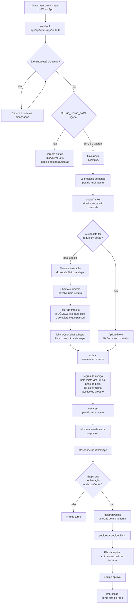

# O cérebro da IA da Doce Pão

Onde estamos em 25/08/2026, o que cada peça faz, e o que ainda está aberto.

---

## 1. O caminho de uma mensagem

## 2. Quem decide o quê

A regra que organiza tudo: **decisão que custa dinheiro mora no código, não no
prompt.**

| Decisão | Quem decide | Onde |
| --- | --- | --- |
| Qual etapa vem agora | código | `fluxo/etapas.ts` |
| O que pode ser dito nesta etapa | código | `fluxo/leitura.ts` |
| Interpretar a frase ("aquele de nozes") | modelo | a chamada |
| O que está escrito com todas as letras | **código** | `fluxo/leitor-da-frase.ts` |
| Preço de cada item | código | `orcamento.ts` + `catalogo.json` |
| Quantos quilos de bolo | código | `fluxo/fluxo.ts` |
| Nome do produto que o corretor estragou | código | `dados/apelidos.ts` |
| Se um item pode sair do pedido | **código** | `cerebro.ts`, exige pedido do cliente |
| Se o pedido pode fechar | código | guardas em `cerebro.ts` |
| Confirmar o pedido com o cliente | **equipe**, nunca a IA | fila do painel |

## 3. Onde os dados moram

Postgres, schema `docepao`, no mesmo servidor do hub.

- `clientes`, `mensagens` — a conversa
- `pedido_montagem` — o pedido **enquanto** se conversa (itens + estado do fluxo)
- `pedidos`, `pedido_itens` — o pedido **fechado**, o que a equipe vê
- `fila_impressao` — o que a ponte imprime

Quando o pedido fecha, os itens saem da montagem e vão para `pedido_itens`. Por
isso o medidor olha os dois lugares: olhar só um reprova quem fez tudo certo.

## 4. Como isso é medido

Duas coisas diferentes, e a segunda é a que pega defeito de verdade.

**`testes/todos.cjs`** — 64 testes. Cada um nasceu de um erro real. Rápidos,
mas cada um mede uma regra isolada.

**`testes/medidor.cjs`** — roda **conversas inteiras** contra a produção e julga
pelo **estado do banco**, não pelo texto. Roda K vezes e exige acerto nas K
(`pass^k`), porque rodar uma vez é sorteio.

O que mudou aqui em 25/08: até então eu escrevia **um cenário por defeito**,
então cada teste provava que aquele bug específico não voltou e a família dele
seguia aberta. Foi assim que dez defeitos couberam numa conversa com setenta
testes verdes.

Agora existe **o mesmo pedido dito de cinco jeitos**, com gabarito único: tudo
numa mensagem, picado, três respostas na mesma frase, com erro de digitação, e
mudando de ideia no meio. Se um passa e outro não, a leitura depende do jeito de
falar, e é isso que não pode.

## 5. As regras que sustentam o desenho

Cada uma nasceu de um defeito que chegou ao cliente.

1. **Nada some do pedido.** Se falta informação, pergunta. Nunca apaga.
   Guarda que bloqueia registro faz o modelo apagar o item para se livrar dela.
   Critério para toda guarda nova: *qual é o jeito mais barato de o modelo
   satisfazer isso? Se for "apagando", a guarda está errada.*
2. **O código lê a frase, não só o modelo.** O que ele deixa passar, some.
3. **Detalhe opcional não segura pedido completo.** Quem já disse item, data,
   hora, nome e pagamento não fica preso numa pergunta que nunca lhe foi feita.
4. **Sinônimo se resolve em lista, não afrouxando comparação.** Afrouxar casa
   produto errado.
5. **O nome do produto ganha do recheio.** Ordenar candidato por nome mais
   comprido fez `quiche de frango` virar pizza de R$ 120.
6. **A IA nunca confirma pedido sozinha.** Sempre passa pela equipe.

## 6. O que está fechado

| Defeito | Como está |
| --- | --- |
| Item pedido sumindo do pedido | fechado, remoção exige pedido do cliente |
| Bolo duplicando (3 bolos, 6 kg) | fechado |
| Bolo cobrado por unidade | fechado |
| Peso do bolo virando observação | fechado |
| `misto:` repetido no cupom | fechado |
| Segunda cor de forminha descartada | fechado |
| Forminha sumindo quando vem junto com o item | fechado |
| Papel de arroz perguntado duas vezes | fechado |
| Pedido travando sem fechar | fechado |
| `quiche de frango` cotado a R$ 120 | fechado |
| `mini bolha de carne` cotado a R$ 20,90 | fechado |

## 7. O que continua aberto

**Item citado fora da etapa dele é jogado fora.** Em
[leitura.ts:328](lib/ia/fluxo/leitura.ts#L328), quando o cliente diz
`"50 brigadeiro, forminha rosa, e um bolo de 2 kg de 4 leites"` estando na etapa
do docinho, o bolo é filtrado e **descartado**. O código guarda só o nome numa
lista para decidir o rumo da conversa. Se o cliente não repetir, o bolo não
existe.

É o mesmo defeito do quiche por outra porta. O conserto é **estacionar em vez de
descartar**: o item barrado fica guardado no estado e é aplicado sozinho quando a
conversa chegar naquela etapa. Com uma ressalva: item barrado por **não existir
no cardápio** continua sendo recusado, porque aí a recusa é honesta.

**A IA confirma em vez de anotar.** Quando o cliente diz tudo numa mensagem, ela
às vezes responde `"Você quer X, certo?"` sem anotar nada. Se a conversa cair
ali, não sobra registro. Mesma família.

**`qa-concorrencia` vermelho**, pelo motivo acima.

**Duas decisões suas em aberto:** manter ou tirar a pergunta do prato (não existe
no fluxograma da Kemilly), e a ordem das perguntas de papel de arroz e topo.

## 8. Onde tem risco escondido

- **Dois cérebros no repositório.** `cerebro.ts` (antigo, com ferramentas) e
  `lib/ia/fluxo` (novo). O novo é o padrão, e `FLUXO_NOVO_PARA=nao` volta para o
  antigo em segundos, sem deploy. O preço disso é que **editar o antigo não muda
  nada em produção**: aconteceu comigo nesta sessão, corrigi dois defeitos no
  arquivo errado e dei como feitos.
- **Regex com `\b` vira byte de backspace** no caminho até o disco e a regra
  nunca casa. Já custou caro quatro vezes. Existe o teste
  `nenhum-byte-quebrado.cjs` justamente para isso, e ele pega toda vez.
